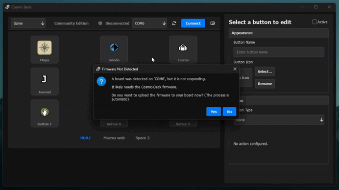
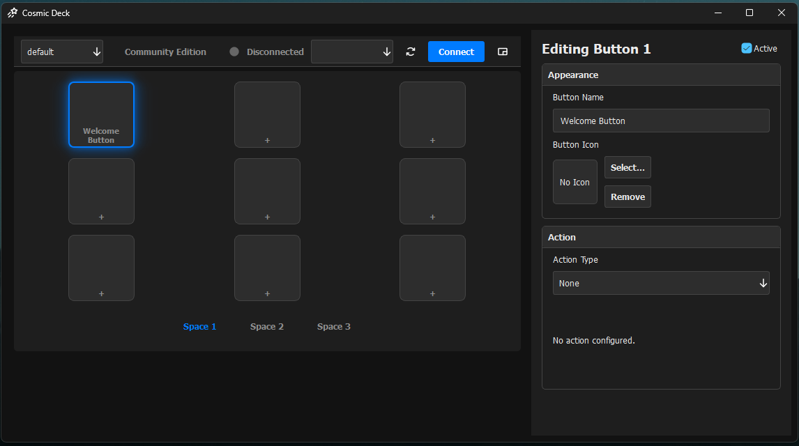

# 🌌 Cosmic Deck
### Macro Pad híbrido de productividad — de Arduino a hardware profesional

<!-- IMAGEN PRINCIPAL / HERO -->
<!-- Reemplaza el archivo por una imagen real del proyecto -->
<!--

  

-->

**Cosmic Deck** es un proyecto de productividad que busca unir dos mundos que hoy están rotos:

- Dispositivos cerrados con software potente pero hardware dependiente  
- Hardware libre que funciona en cualquier PC, pero sin integración real  

La **Community Edition (BETA)** convierte un **Arduino común** en un macro pad funcional y configurable, mientras se construye el camino hacia un ecosistema híbrido más avanzado.

🌐 Web oficial: https://cosmicdeck.algoritmox86.com/
🔧 Video Sobre el Funcionamiento: https://youtu.be/Pj6zKplLFqY

---

## 🎯 ¿Qué es Cosmic Deck HOY?

✔️ Aplicación de escritorio para Windows  
✔️ Sistema de macros y atajos personalizables  
✔️ Compatible con Arduino Uno, Nano y Mega  
✔️ Pensado para productividad real: programadores, editores, streamers y power users  

> ⚠️ Esta versión es una **BETA COMMUNITY** enfocada en estabilidad, feedback y usabilidad.

---

## 🔌 ¿Qué problema resuelve?

El mercado actual de macro pads está polarizado:

- **Ecosistemas cerrados** → software potente, hardware dependiente  
- **Hardware libre** → funciona en cualquier PC, pero sin integración  

Cosmic Deck nace como un **puente entre software inteligente y hardware flexible**, permitiendo crear flujos de trabajo rápidos, claros y reutilizables.

---

## 🛠️ Community Edition (DIY)

<!-- IMAGEN COMMUNITY / CONEXIONES -->

  

La versión Community está pensada para makers, estudiantes y usuarios técnicos.

### ✔️ Hardware compatible
- Arduino Uno  
- Arduino Nano  
- Arduino Mega  

### ✔️ Funciones incluidas
- Perfiles configurables
- Macros con múltiples acciones
- Combinaciones de teclas
- Ejecutar programas del sistema
- Abrir URLs
- Escribir texto automáticamente
- Control multimedia
- Delays entre acciones
- Feedback visual en pantalla (mini-grid)

💰 **Costo:** Gratis  
📦 **Requisito:** Arduino + botones físicos  

---

## 🖥️ Aplicación de Escritorio

<!-- IMAGEN UI DE LA APP -->

  

La aplicación Cosmic Deck permite:
- Crear perfiles y espacios
- Asignar acciones a cada botón
- Visualizar el estado del macro pad
- Flashear automáticamente el firmware al Arduino

---

## 🔮 Visión del Proyecto

<!-- IMAGEN / RENDER DEL PROTOTIPO PRO -->

  

Cosmic Deck evoluciona hacia un **Ecosistema Híbrido de Productividad**:

- Hardware oficial **Cosmic Pad Pro** (RP2040)
- Modo HID autónomo (funciona sin software)
- Integraciones con software profesional (OBS, edición, desarrollo)
- Sistema de módulos y expansión

🎥 **Video: Visión del proyecto**  
👉 https://youtu.be/4u1hUAh1izE

> ⚠️ Estas funciones corresponden a versiones futuras y no son necesarias para usar la Community Edition hoy.

---

## 🚀 Inicio rápido (Community)

1. Descarga la aplicación Cosmic Deck (BETA)
2. Conecta tu Arduino por USB
3. Flashea el firmware desde la app
4. Crea perfiles y asigna acciones
5. Usa tu macro pad en minutos

⏱️ Tiempo estimado: **10 minutos**

---

## 📂 Contenido de este repositorio

Este repositorio **NO contiene código fuente**.

Aquí encontrarás:
- Documentación del proyecto
- Guías de conexión para Community Edition
- Esquemáticos DIY
- Manuales de uso
- Roadmap público

---

## 🔒 Sobre el código y el proyecto

Cosmic Deck es un proyecto independiente desarrollado por una sola persona.

- La **Community Edition es gratuita**
- El software y firmware son propietarios
- La documentación DIY es pública
- El hardware Arduino sigue siendo completamente reutilizable

Este enfoque permite mantener el proyecto sostenible y seguir mejorándolo.

---

## 📈 Roadmap

- [x] Diciembre 2025 — Beta Launch (Community Edition)
- [ ] Q1 2026 — Hardware oficial Cosmic Pad Pro
- [ ] Q2 2026 — Integraciones con software profesional

---

## 💬 Feedback

Este proyecto está en BETA.  
Tu feedback es clave para mejorar Cosmic Deck.

- Issues de GitHub
- Feedback desde la comunidad
- Comunidad en Telegram [Haz Clic Aqui](https://t.me/+qKxLbYER3bM4YTJh)

---

## 🛠️ Tecnologias y Recursos usados
- PySide6 -> [Repositorio Oficial](https://github.com/qtproject/pyside-pyside-setup/tree/dev)
- Phosphor Icons -> [Web Oficial](https://phosphoricons.com/)

Creado con ❤️ por **José Sánchez** — México  
