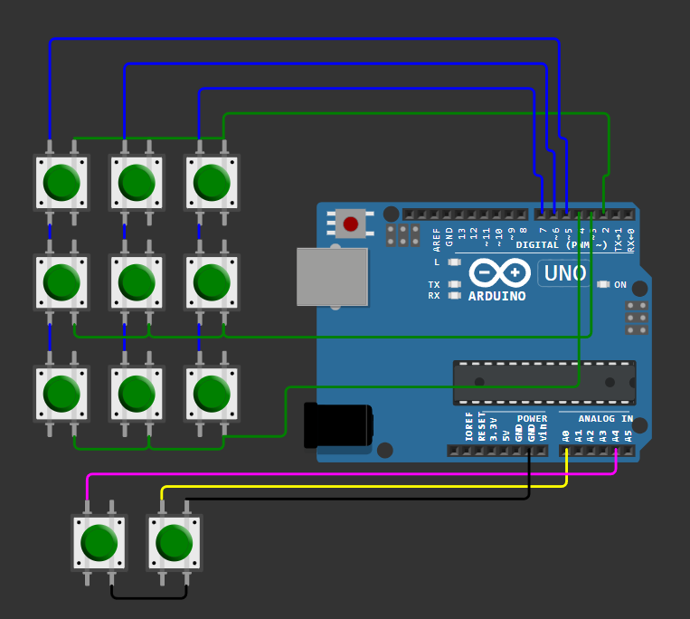
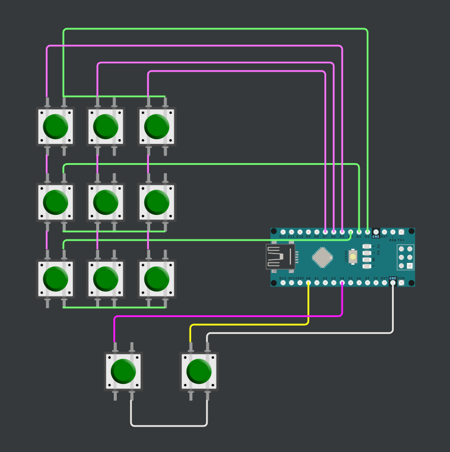
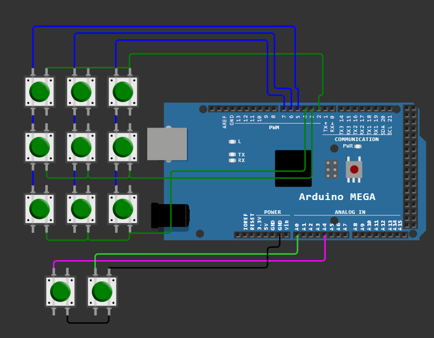

# 🌌 Cosmic Deck — Community Edition  
## Arduino Wiring & Button Connections

Esta guía explica cómo conectar los botones a tu Arduino para usar **Cosmic Deck Community Edition**.

La Community Edition convierte un **Arduino común** en un macro pad funcional con múltiples espacios de trabajo, ideal para productividad, automatización y atajos personalizados.

🔧 Video Sobre el Funcionamiento: https://youtu.be/Pj6zKplLFqY

---

## 🔧 Hardware requerido

- Arduino **Uno**, **Nano** o **Mega**
- **11 botones momentáneos** (push buttons)
- Cables Dupont
- (Opcional) Protoboard o PCB DIY

> ⚠️ **Importante:**  
> El mismo esquema de pines se utiliza para **todos los Arduinos mencionados**.

---

## 🧠 Distribución lógica de botones

Cosmic Deck Community utiliza un total de **11 botones físicos**, organizados en dos grupos:

---

### 🔲 Matriz principal (9 botones)

- Disposición **3 × 3**
- Cada botón es **totalmente programable**
- Ejecutan las acciones asignadas en el **espacio activo**

Estos botones representan el núcleo del flujo de trabajo y permiten ejecutar:
- Macros
- Atajos de teclado
- Acciones del sistema
- Texto, multimedia y combinaciones

---

### ⬅️➡️ Botones auxiliares (2 botones inferiores)

Los dos botones ubicados en la parte inferior permiten **navegar entre espacios**, reutilizando los mismos 9 botones principales.

| Botón | Función |
|------|--------|
| Auxiliar izquierdo | Cambiar al espacio anterior |
| Auxiliar derecho   | Cambiar al siguiente espacio |

---

## 📌 Asignación de pines (válida para todos los Arduinos)

---

### 🔲 Matriz principal (9 botones)

> ⚠️ **Importante:**  
> **Revisar diagrama de conexiones**.
---

### ⬅️➡️ Botones auxiliares

| Función | Pin Arduino |
|-------|-------------|
| Espacio anterior | A0 |
| Espacio siguiente | A4 |

> 💡 Los pines **A0 y A1** se usan como **entradas digitales**.

---

## 🔌 Conexión eléctrica

- Cada botón se conecta entre:
  - Un **pin del Arduino**
  - **GND**
- Se utilizan las **resistencias pull-up internas**
- No se requieren resistencias externas
- **No conectes ningún botón a 5V**

📌 Todos los botones deben compartir **GND común**.

---

## 🖼️ Diagrama de conexión — Arduino Uno

  

> Este mismo esquema aplica para **Arduino Nano y Arduino Mega**, respetando el mismo número de pin.

## 🖼️ Diagrama de conexión — Arduino Nano

  

## 🖼️ Diagrama de conexión — Arduino Mega

  

---

## 🚀 Flujo de uso esperado

1. Presiona uno de los **9 botones principales**  
   → Se ejecuta la acción asignada en el espacio actual  

2. Presiona el botón **auxiliar izquierdo**  
   → Cambia al espacio anterior  

3. Presiona el botón **auxiliar derecho**  
   → Cambia al siguiente espacio  

La aplicación muestra visualmente el espacio activo.

---

## 🛠️ Solución de problemas

**❌ Un botón no responde**
- Revisa el cableado
- Verifica el pin correcto
- Asegúrate de que comparte GND

**❌ El botón se activa solo**
- Revisa soldaduras
- Evita cables largos o sueltos

**❌ Arduino no detectado**
- Revisa el puerto COM
- Verifica Tener Drivers Adecuados Instalados del modelo de tu placa
- Desconecta y vuelve a conectar
- Reinicia la aplicación

---

## ✅ Siguiente paso

Una vez completadas las conexiones:

1. Abre **Cosmic Deck App**
2. Conecta tu Arduino por USB
3. Flashea el firmware desde la aplicación
4. Crea perfiles y asigna acciones
5. Empieza a usar tu macro pad

⏱️ Tiempo estimado: **10 minutos**

---

Cosmic Deck Community Edition —  
**De hardware simple a productividad real.**
